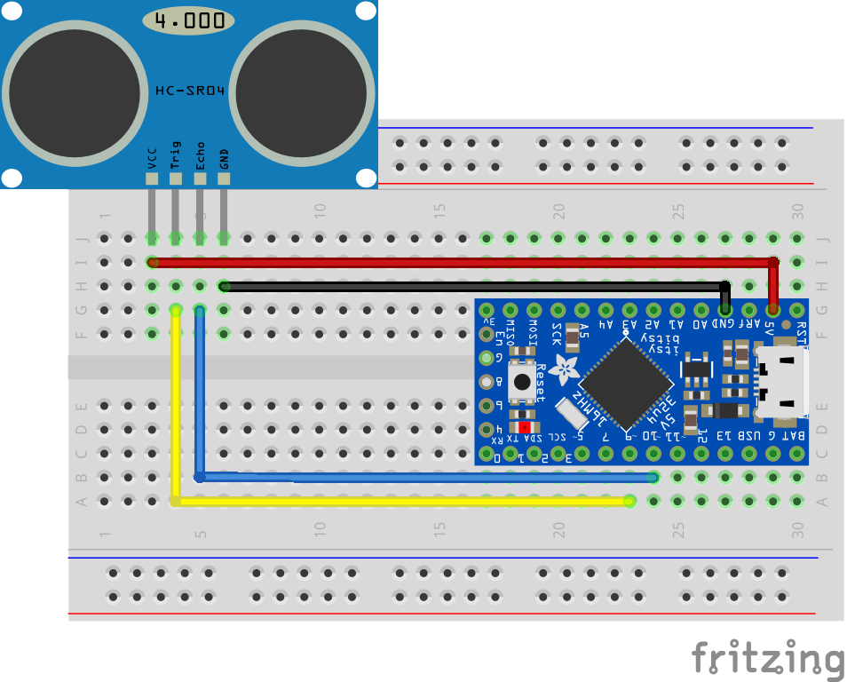

# Custom Controller Demos
This project contains a collection of custom controller designs, associated wiring diagrams, arduino code and example Unity projects showcasing the controllers. The example controllers are focused and each implements a simple sensor as a form on Input for the game. The controllers use sensors include pressure sensors, a flex sensor, a ultra-sonic distance sensor and an orientation sensor.

# Installation
Unity 2018.3.4f1
Unity's new Input System (currently in preview)
Arduino IDE (or similar) for programming the arduino based controllers

# Files Included
[Arduino Code](ArduinoCode) contains the example code for the hardware controllers.
[DistanceDemo](DistanceDemo), [FlexDemo](FlexDemo), [orientationeDemo](OrientationDemo), [PressureDemo](PressureDemo) contain standalone example Unity projects. One for each of the four example controllers. 

# Wiring diagrams
